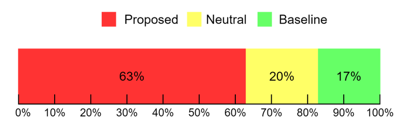

# Abstract

The accuracy of prosodic structure prediction is crucial to the naturalness of synthesized speech in Mandarin text-to-speech system, but now is limited by widely-used sequence-to-sequence framework and error accumulation from previous word segmentation results. In this paper, we propose a span-based Mandarin prosodic structure prediction model to obtain an optimal prosodic structure tree, which can be converted to corresponding prosodic label sequence. Instead of the prerequisite for word segmentation, rich linguistic features are provided by Chinese character-level BERT and sent to encoder with self-attention architecture. On top of this, span representation and label scoring are used to describe all possible prosodic structure trees, of which each tree has its corresponding score. To find the optimal tree with the highest score for a given sentence, a bottom-up CKYstyle algorithm is further used. The proposed method can predict prosodic labels of different levels at the same time and accomplish the process directly from Chinese characters in an end-to-end manner. Experiment results on two real-world datasets demonstrate the excellent performance of our span-based method over all sequenceto-sequence baseline approaches.

# Subjective Evaluation

We further conduct an AB preference test on the naturalness of the synthesized speech. We compare our proposed model Transformer-Tree with the baseline Transformer-CRF (the previous state-of-the-art model). A set of 20 sentences are randomly selected from the test set with different prosodic structure prediction results and corresponding speeches are generated through a Tacotron 2 TTS model. A group of 20 subjects are asked to give their preference in terms of the naturalness for each speech. The percentage preference is shown in the following figure. We can clearly see that the proposed model Transformer-Tree is significantly better than the baseline model Transformer-CRF in terms of the naturalness of synthesized speech.

|         |    Method     | Chinese text / Prosodic structure label | Audio |
|:--|:---------|:---------------------------------------|:------|
| 1 | Baseline | 中国是禁止涉外婚介的，不信你可以上网查查。  _0_1_2_0_1_0_1_0_0_3，_0_0_2_0_1_0_1_0_3。   zhong1 - guo2 ` shi4 / jin4 - zhi3 ` she4 - wai4 ` hun1 - jie4 - de5 , bu2 - xin4 - ni3 / ke6 - yi3 ` shang4 - wang3 ` cha2 - cha5 . |<audio controls><source src="./wavs/Baseline/b01.wav" type="audio/wav">Your browser does not support the audio element.</audio> |
|   | Proposed | 中国是禁止涉外婚介的，不信你可以上网查查。  _0_1_1_0_1_0_1_0_0_3，_0_3_0_0_1_0_1_0_3。   zhong1 - guo2 ` shi4 ` jin4 - zhi3 ` she4 - wai4 ` hun1 - jie4 - de5 , bu2 - xin4 , ni3 - ke6 - yi3 ` shang4 - wang3 ` cha2 - cha5 . |<audio controls><source src="./wavs/Proposed/p01.wav" type="audio/wav">Your browser does not support the audio element.</audio>   |
|   |    |   |
| 2 | Baseline | 其次，玉米食用油尤其是玉米胚芽油正越来越多的推向市场。  _0_3，_0_1_0_0_1_0_1_2_0_1_0_1_2_1_0_1_0_0_1_0_1_0_3。  qi2 - ci4 , yu4 - mi3 ` shi2 - yong4 - you2 ` you2 - qi2 ` shi4 / yu4 - mi3 ` pei1 - ya2 ` you2 / zheng4 ` yue4 - lai2 ` yue4 - duo1 - de5 ` tui1 - xiang4 ` shi4 - chang3 .|<audio controls><source src="./wavs/Baseline/b02.wav" type="audio/wav">Your browser does not support the audio element.</audio> |
|   | Proposed | 其次，玉米食用油尤其是玉米胚芽油正越来越多的推向市场。  _0_3，_0_1_0_0_2_0_0_2_0_1_0_0_3_2_0_1_0_0_1_0_1_0_3。  qi2 - ci4 , yu4 - mi3 ` shi2 - yong4 - you2 / you2 - qi2 - shi4 / yu4 - mi3 ` pei1 - ya2 - you2 , zheng4 / yue4 - lai2 ` yue4 - duo1 - de5 ` tui1 - xiang4 ` shi4 - chang3 . |<audio controls><source src="./wavs/Proposed/p02.wav" type="audio/wav">Your browser does not support the audio element.</audio>   |
|   |    |   |
| 3 | Baseline | 一般认为，确定耶路撒冷的地位是解决巴以冲突的核心问题。  _0_1_0_3，_0_1_0_1_0_0_1_0_1_1_0_0_2_0_1_0_1_0_1_0_3。  yi4 - ban1 ` ren4 - wei2 , que4 - ding4 ` ye1 - lu4 ` sa1 - leng3 - de5 ` di4 - wei4 ` shi4 ` jie3 - jue2 - ba1 / yi3 - chong1 ` tu1 - de5 ` he2 - xin1 ` wen4 - ti2 .|<audio controls><source src="./wavs/Baseline/b03.wav" type="audio/wav">Your browser does not support the audio element.</audio> |
|   | Proposed | 一般认为，确定耶路撒冷的地位是解决巴以冲突的核心问题。  _0_1_0_3，_0_2_0_1_0_0_1_0_3_1_0_1_0_1_0_0_1_0_1_0_3。  yi4 - ban1 ` ren4 - wei2 , que4 - ding4 / ye1 - lu4 ` sa1 - leng3 - de5 ` di4 - wei4 , shi4 ` jie3 - jue2 ` ba1 - yi3 ` chong1 - tu1 - de5 ` he2 - xin1 ` wen4 - ti2 . |<audio controls><source src="./wavs/Proposed/p03.wav" type="audio/wav">Your browser does not support the audio element.</audio>   |
|   |    |   |
| 4 | Baseline | 但愿他的忏悔是真诚的。  _0_1_0_1_0_1_0_1_0_3。   dan4 - yuan4 ` ta1 - de5 ` chan4 - hui3 ` shi4 - zhen1 ` cheng2 - de5 . |<audio controls><source src="./wavs/Baseline/b04.wav" type="audio/wav">Your browser does not support the audio element.</audio> |
|   | Proposed | 但愿他的忏悔是真诚的。  _0_3_0_1_0_2_1_0_0_3。   dan4 - yuan4 , ta1 - de5 ` chan4 - hui3 / shi4 ` zhen1 - cheng2 - de5 . |<audio controls><source src="./wavs/Proposed/p04.wav" type="audio/wav">Your browser does not support the audio element.</audio>   |
|   |    |   |
| 5 | Baseline | 宁愿做一朵篱下的野花，不愿做一朵受恩惠的蔷薇。  _0_1_1_0_1_0_0_1_0_3，_0_1_0_0_1_0_1_0_1_0_3。   ning4 - yuan4 ` zuo4 ` yi4 - duo3 ` li2 - xia4 - de5 ` ye3 - hua1 , bu2 - yuan4 ` zuo4 - yi4 - duo3 ` shou4 - en1 ` hui4 - de5 ` qiang2 - wei1 .|<audio controls><source src="./wavs/Baseline/b05.wav" type="audio/wav">Your browser does not support the audio element.</audio> |
|   | Proposed | 宁愿做一朵篱下的野花，不愿做一朵受恩惠的蔷薇。  _0_2_0_0_1_0_0_1_0_3，_0_1_1_0_2_1_0_0_1_0_3。   ning4 - yuan4 ` zuo4 - yi4 - duo3 ` li2 - xia4 - de5 ` ye3 - hua1 , bu2 - yuan4 ` zuo4 - yi4 - duo3 ` shou4 - en1 ` hui4 - de5 ` qiang2 - wei1 .|<audio controls><source src="./wavs/Proposed/p05.wav" type="audio/wav">Your browser does not support the audio element.</audio>   |
|   |    |   |
| 6 | Baseline | 叙利亚总统阿萨德与黎巴嫩总统苏莱曼的会谈也令人瞩目。  _0_0_1_0_1_0_1_2_1_0_0_2_0_1_0_0_0_1_0_1_0_0_2_0_3。   xu4 - li4 - ya4 ` zong6 - tong3 ` a1 - sa4 ` de2 / yu3 ` li2 - ba1 - nen4 / zong6 - tong3 ` su1 - lai2 - man4 - de5 ` hui4 - tan2 ` ye3 - ling4 - ren2 / zhu3 - mu4 .|<audio controls><source src="./wavs/Baseline/b06.wav" type="audio/wav">Your browser does not support the audio element.</audio> |
|   | Proposed | 叙利亚总统阿萨德与黎巴嫩总统苏莱曼的会谈也令人瞩目。  _0_0_1_0_1_0_0_3_2_0_0_1_0_2_0_0_0_1_0_2_1_0_0_0_3。   xu4 - li4 - ya4 ` zong6 - tong3 ` a1 - sa4 ` de2 , yu3 / li2 - ba1 - nen4 ` zong6 - tong3 / su1 - lai2 - man4 - de5 ` hui4 - tan2 / ye3 ` ling4 - ren2 - zhu3 - mu4 .|<audio controls><source src="./wavs/Proposed/p06.wav" type="audio/wav">Your browser does not support the audio element.</audio>   |
|   |    |   |
| 7 | Baseline | 下了一个星期的雨了，每天待家里哪也去不了。  _0_1_0_1_0_0_1_0_3，_0_2_0_0_2_0_1_0_0_3。   xia4 - le5 ` yi2 - ge5 ` xing1 - qi1 - de5 ` yu3 - le5 , mei3 - tian1 / dai1 - jia1 - li3 / na6 - ye3 ` qu4 - bu4 - liao3 .|<audio controls><source src="./wavs/Baseline/b07.wav" type="audio/wav">Your browser does not support the audio element.</audio> |
|   | Proposed | 下了一个星期的雨了，每天待家里哪也去不了。  _0_1_0_1_0_0_1_0_3，_0_1_1_0_2_0_1_0_0_3。   xia4 - le5 ` yi2 - ge5 ` xing1 - qi1 - de5 ` yu3 - le5 , mei3 - tian1 ` dai1 ` jia1 - li3 / na6 - ye3 ` qu4 - bu4 - liao3 . |<audio controls><source src="./wavs/Proposed/p07.wav" type="audio/wav">Your browser does not support the audio element.</audio>   |
|   |    |   |
| 8 | Baseline | 喜爱与收藏这些娃娃的人主要以女性居多。  _0_2_1_0_1_0_1_0_0_0_1_0_2_0_0_1_0_3。   xi3 - ai4 / yu3 ` shou1 - cang2 ` zhe4 - xie1 ` wa2 - wa5 - de5 - ren2 ` zhu3 - yao4 / yi3 - nv3 - xing4 ` ju1 - duo1 . |<audio controls><source src="./wavs/Baseline/b08.wav" type="audio/wav">Your browser does not support the audio element.</audio> |
|   | Proposed | 喜爱与收藏这些娃娃的人主要以女性居多。  _0_2_1_0_1_0_1_0_0_0_3_0_1_1_0_1_0_3。   xi3 - ai4 / yu3 ` shou1 - cang2 ` zhe4 - xie1 ` wa2 - wa5 - de5 - ren2 , zhu3 - yao4 ` yi3 ` nv3 - xing4 ` ju1 - duo1 . |<audio controls><source src="./wavs/Proposed/p08.wav" type="audio/wav">Your browser does not support the audio element.</audio>   |
|   |    |   |
| 9 | Baseline | 这些员工要参与产品测试，并及时提供反馈。  _0_1_1_0_1_0_1_0_1_0_3，_1_0_1_0_1_0_3。   zhe4 - xie1 ` yuan2 ` gong1 - yao4 ` can1 - yu4 ` chan6 - pin3 ` ce4 - shi4 , bing4 ` ji2 - shi2 ` ti2 - gong1 ` fan3 - kui4 .|<audio controls><source src="./wavs/Baseline/b09.wav" type="audio/wav">Your browser does not support the audio element.</audio> |
|   | Proposed | 这些员工要参与产品测试，并及时提供反馈。  _0_1_0_2_1_0_2_0_1_0_3，_2_0_2_0_1_0_3。   zhe4 - xie1 ` yuan2 - gong1 / yao4 ` can1 - yu4 / chan6 - pin3 ` ce4 - shi4 , bing4 / ji2 - shi2 / ti2 - gong1 ` fan3 - kui4 . |<audio controls><source src="./wavs/Proposed/p09.wav" type="audio/wav">Your browser does not support the audio element.</audio>   |
|   |    |   |
| 10 | Baseline | 走近才发现，大桥已垮塌。  _2_0_1_0_3，_0_2_1_0_3。   zou3 / jin4 - cai2 ` fa1 - xian4 , da4 - qiao2 / yi6 ` kua3 - ta1 .|<audio controls><source src="./wavs/Baseline/b10.wav" type="audio/wav">Your browser does not support the audio element.</audio> |
|   | Proposed | 走近才发现，大桥已垮塌。   _0_2_0_0_3，_0_1_0_0_3。   zou3 - jin4 / cai2 - fa1 - xian4 , da4 - qiao2 ` yi6 - kua3 - ta1 .|<audio controls><source src="./wavs/Proposed/p10.wav" type="audio/wav">Your browser does not support the audio element.</audio>   |
|   |    |   |
| 11 | Baseline | 如今那些所谓当红女星，成千上万，哪一个拥有这样酷的眼神。   _0_1_0_1_0_1_0_1_0_3，_1_0_0_3，_0_0_1_0_1_0_1_0_1_0_3。   ru2 - jin1 ` na4 - xie1 ` suo3 - wei4 ` dang1 - hong2 ` nv3 - xing1 , cheng2 ` qian1 - shang4 - wan4 , na3 - yi2 - ge5 ` yong1 - you3 ` zhe4 - yang4 ` ku4 - de5 ` yan3 - shen2 .|<audio controls><source src="./wavs/Baseline/b11.wav" type="audio/wav">Your browser does not support the audio element.</audio> |
|    | Proposed | 如今那些所谓当红女星，成千上万，哪一个拥有这样酷的眼神。  _0_1_0_1_0_2_0_1_0_3，_0_0_0_3，_0_0_2_0_1_0_1_0_1_0_3。   ru2 - jin1 ` na4 - xie1 ` suo3 - wei4 / dang1 - hong2 ` nv3 - xing1 , cheng2 - qian1 - shang4 - wan4 , na3 - yi2 - ge5 / yong1 - you3 ` zhe4 - yang4 ` ku4 - de5 ` yan3 - shen2 . |<audio controls><source src="./wavs/Proposed/p11.wav" type="audio/wav">Your browser does not support the audio element.</audio>   |
|   |    |   |
| 12 | Baseline | 倘若一个人出名正出得半红不紫，那他是断不会淡薄的。  _0_1_0_0_1_0_1_0_0_1_0_1_0_3，_0_0_1_0_0_1_0_0_3。   tang3 - ruo4 ` yi2 - ge5 - ren2 ` chu1 - ming2 ` zheng4 - chu1 - de5 ` ban4 - hong2 ` bu4 - zi3 , na4 - ta1 - shi4 ` duan4 - bu2 - hui4 ` dan4 - bo2 - de5 .|<audio controls><source src="./wavs/Baseline/b12.wav" type="audio/wav">Your browser does not support the audio element.</audio> |
|    | Proposed | 倘若一个人出名正出得半红不紫，那他是断不会淡薄的。  _0_2_0_0_1_0_2_0_0_1_0_1_0_3，_0_0_2_0_0_1_0_0_3。   tang3 - ruo4 / yi2 - ge5 - ren2 ` chu1 - ming2 / zheng4 - chu1 - de5 ` ban4 - hong2 ` bu4 - zi3 , na4 - ta1 - shi4 / duan4 - bu2 - hui4 ` dan4 - bo2 - de5 . |<audio controls><source src="./wavs/Proposed/p12.wav" type="audio/wav">Your browser does not support the audio element.</audio>   |
|   |    |   |
| 13 | Baseline | 经突审，犯罪嫌疑人刘迎儿交代了犯罪事实和主要犯罪动机。  _1_0_3，_0_1_0_0_2_0_0_1_0_0_1_0_0_0_1_1_0_1_0_1_0_3。   jing1 ` tu1 - shen3 , fan4 - zui4 ` xian2 - yi2 - ren2 / liu2 - ying2 - er5 ` jiao1 - dai4 - le5 ` fan4 - zui4 - shi4 - shi2 ` he2 ` zhu3 - yao4 ` fan4 - zui4 ` dong4 - ji1 .|<audio controls><source src="./wavs/Baseline/b13.wav" type="audio/wav">Your browser does not support the audio element.</audio> |
|    | Proposed | 经突审，犯罪嫌疑人刘迎儿交代了犯罪事实和主要犯罪动机。  _1_0_3，_0_1_0_0_2_0_0_2_0_0_1_0_1_0_2_1_0_1_0_1_0_3。   jing1 ` tu1 - shen3 , fan4 - zui4 ` xian2 - yi2 - ren2 / liu2 - ying2 - er5 / jiao1 - dai4 - le5 ` fan4 - zui4 ` shi4 - shi2 / he2 ` zhu3 - yao4 ` fan4 - zui4 ` dong4 - ji1 . |<audio controls><source src="./wavs/Proposed/p13.wav" type="audio/wav">Your browser does not support the audio element.</audio>   |
|   |    |   |
| 14 | Baseline | 根据质地我们可以看到分若干个品种。  _0_1_0_1_0_1_0_1_0_2_0_1_0_1_0_3。   gen1 - ju4 ` zhi4 - di4 ` wo3 - men5 ` ke6 - yi3 ` kan4 - dao4 / fen1 - ruo4 ` gan1 - ge4 ` pin6 - zhong3 .|<audio controls><source src="./wavs/Baseline/b14.wav" type="audio/wav">Your browser does not support the audio element.</audio> |
|    | Proposed | 根据质地我们可以看到分若干个品种。  _0_1_0_3_0_1_0_1_0_2_1_0_0_1_0_3。   gen1 - ju4 ` zhi4 - di4 , wo3 - men5 ` ke6 - yi3 ` kan4 - dao4 / fen1 ` ruo4 - gan1 - ge4 ` pin6 - zhong3 .  |<audio controls><source src="./wavs/Proposed/p14.wav" type="audio/wav">Your browser does not support the audio element.</audio>   |
|   |    |   |
| 15 | Baseline | 随着英文名越来越火，帮人取英文名这一行当也成了香馍馍。  _0_2_0_1_0_0_1_0_3，_0_2_0_0_0_1_0_1_0_1_0_0_1_0_0_3。  sui2 - zhe5 / ying1 - wen2 ` ming2 - yue4 - lai2 ` yue4 - huo3 , bang1 - ren2 / qu3 - ying1 - wen2 - ming2 ` zhe4 - yi4 ` hang2 - dang4 ` ye3 - cheng2 - le5 ` xiang1 - mo2 - mo5 . |<audio controls><source src="./wavs/Baseline/b15.wav" type="audio/wav">Your browser does not support the audio element.</audio> |
|    | Proposed | 随着英文名越来越火，帮人取英文名这一行当也成了香馍馍。  _0_2_0_0_2_0_1_0_3，_0_0_1_0_0_2_0_0_0_3_0_0_1_0_0_3。   sui2 - zhe5 / ying1 - wen2 - ming2 / yue4 - lai2 ` yue4 - huo3 , bang1 - ren2 - qu3 ` ying1 - wen2 - ming2 / zhe4 - yi4 - hang2 - dang4 , ye3 - cheng2 - le5 ` xiang1 - mo2 - mo5 . |<audio controls><source src="./wavs/Proposed/p15.wav" type="audio/wav">Your browser does not support the audio element.</audio>   |
|   |    |   |
| 16 | Baseline | 考试期间，首尔的宾馆旅店爆满，连桑拿中心也生意兴隆。  _0_1_0_3，_0_0_1_0_2_0_1_0_3，_0_1_0_0_1_0_0_1_0_3。   kao3 - shi4 ` qi1 - jian1 , shou6 - er3 - de5 ` bin1 - guan3 / lv3 - dian4 ` bao4 - man3 , lian2 - sang1 ` na2 - zhong1 - xin1 / ye3 - sheng1 - yi5 ` xing1 - long2 .|<audio controls><source src="./wavs/Baseline/b16.wav" type="audio/wav">Your browser does not support the audio element.</audio> |
|    | Proposed | 考试期间，首尔的宾馆旅店爆满，连桑拿中心也生意兴隆。  _0_1_0_3，_0_0_1_0_1_0_1_0_3，_1_0_1_0_2_1_0_1_0_3。   kao3 - shi4 ` qi1 - jian1 , shou6 - er3 - de5 ` bin1 - guan3 ` lv3 - dian4 ` bao4 - man3 , lian2 ` sang1 - na2 ` zhong1 - xin1 / ye3 ` sheng1 - yi5 ` xing1 ` long2 .|<audio controls><source src="./wavs/Proposed/p16.wav" type="audio/wav">Your browser does not support the audio element.</audio>   |
|   |    |   |
| 17 | Baseline | 我相信小孩子也不希望妈妈每天都在家对他啰嗦吧。  _1_0_2_0_0_0_2_0_0_2_0_2_0_1_1_0_1_0_1_0_0_3。   wo3 ` xiang1 - xin4 / xiao3 - hai2 - zi5 - ye3 / bu4 - xi1 - wang4 / ma1 - ma5 / mei3 - tian1 ` dou1 ` zai4 - jia1 ` dui4 - ta1 ` luo1 - suo5 - ba5 . |<audio controls><source src="./wavs/Baseline/b17.wav" type="audio/wav">Your browser does not support the audio element.</audio> |
|    | Proposed | 我相信小孩子也不希望妈妈每天都在家对他啰嗦吧。  _1_0_2_0_0_2_1_0_0_1_0_2_0_1_0_0_2_0_1_0_0_3。   wo3 ` xiang1 - xin4 / xiao3 - hai2 - zi5 / ye3 ` bu4 - xi1 - wang4 ` ma1 - ma5 / mei3 - tian1 ` dou1 - zai4 - jia1 / dui4 - ta1 ` luo1 - suo5 - ba5 . |<audio controls><source src="./wavs/Proposed/p17.wav" type="audio/wav">Your browser does not support the audio element.</audio>   |
|   |    |   |
| 18 | Baseline | 我会武术谁也挡不住呀。  _0_1_0_1_0_1_0_0_1_3。   wo3 - hui4 ` wu3 - shu4 ` shui2 - ye3 ` dang3 - bu2 - zhu4 ` ya5 .|<audio controls><source src="./wavs/Baseline/b18.wav" type="audio/wav">Your browser does not support the audio element.</audio> |
|    | Proposed | 我会武术谁也挡不住呀。  _0_1_0_2_0_1_0_0_0_3。   wo3 - hui4 ` wu3 - shu4 / shui2 - ye3 ` dang3 - bu2 - zhu4 - ya5 . |<audio controls><source src="./wavs/Proposed/p18.wav" type="audio/wav">Your browser does not support the audio element.</audio>   |
|   |    |   |
| 19 | Baseline | 狐狸说：猴子，凭你这点小小的本事，你这笨蛋还想做兽中之王吗？   _0_0_3，_0_3，_0_1_0_1_0_0_1_0_3，_0_1_0_1_0_1_0_0_1_0_0_3？   hu2 - li5 - shuo1 , hou2 - zi5 , ping2 - ni3 ` zhe4 - dian3 ` xiao6 - xiao3 - de5 ` ben3 - shi5 , ni3 - zhe4 ` ben4 - dan4 ` hai2 - xiang3 ` zuo4 - shou4 - zhong1 ` zhi1 - wang2 - ma5 .|<audio controls><source src="./wavs/Baseline/b19.wav" type="audio/wav">Your browser does not support the audio element.</audio> |
|    | Proposed | 狐狸说：猴子，凭你这点小小的本事，你这笨蛋还想做兽中之王吗？   _0_0_3，_0_3，_0_1_0_1_0_0_1_0_3，_0_1_0_2_0_0_1_0_1_0_0_3？   hu2 - li5 - shuo1 , hou2 - zi5 , ping2 - ni3 ` zhe4 - dian3 ` xiao6 - xiao3 - de5 ` ben3 - shi5 , ni3 - zhe4 ` ben4 - dan4 / hai2 - xiang3 - zuo4 ` shou4 - zhong1 ` zhi1 - wang2 - ma5 .|<audio controls><source src="./wavs/Proposed/p19.wav" type="audio/wav">Your browser does not support the audio element.</audio>   |
|   |    |   |
| 20 | Baseline | 莫欺少年穷，要有信心哦！   _2_0_0_0_3，_0_1_0_0_3！   mo4 / qi1 - shao4 - nian2 - qiong2 , yao4 - you3 ` xin4 - xin1 - o5 .|<audio controls><source src="./wavs/Baseline/b20.wav" type="audio/wav">Your browser does not support the audio element.</audio> |
|    | Proposed | 莫欺少年穷，要有信心哦！   _0_2_0_0_3，_0_1_0_0_3！   mo4 - qi1 / shao4 - nian2 - qiong2 , yao4 - you3 ` xin4 - xin1 - o5 .|<audio controls><source src="./wavs/Proposed/p20.wav" type="audio/wav">Your browser does not support the audio element.</audio>   |

